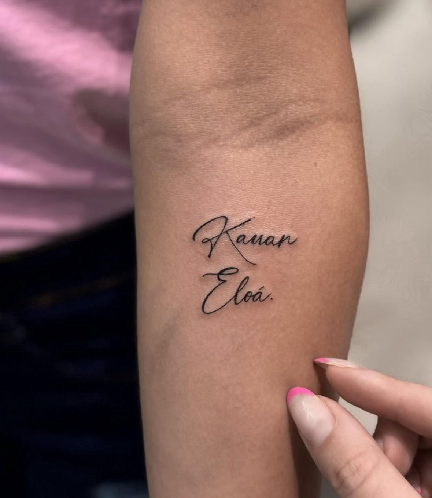

# 🔗 Bionix Link Bio

Site estilo **“Link na Bio”** totalmente personalizado para divulgar todos os seus canais em um só lugar — ideal para tatuadores, estúdios, criadores e profissionais criativos.



---

## 🎯 Funcionalidades

- Layout 100% responsivo (mobile e desktop)
- Imagem de perfil e destaques visuais
- Botões animados com ícones
- Links personalizados para redes sociais
- Estilo visual moderno e leve
- Animações suaves e efeito de clique
- Pronto para deploy via GitHub Pages

---

## 🧩 Tecnologias

- HTML5
- CSS3
- JavaScript (leve)
- Git & GitHub
- GitHub Pages para deploy

---

## 🚀 Como usar

1. **Clone o repositório:**
   ```bash
   git clone https://github.com/Paulinho-coder/bionix-link-bio.git

