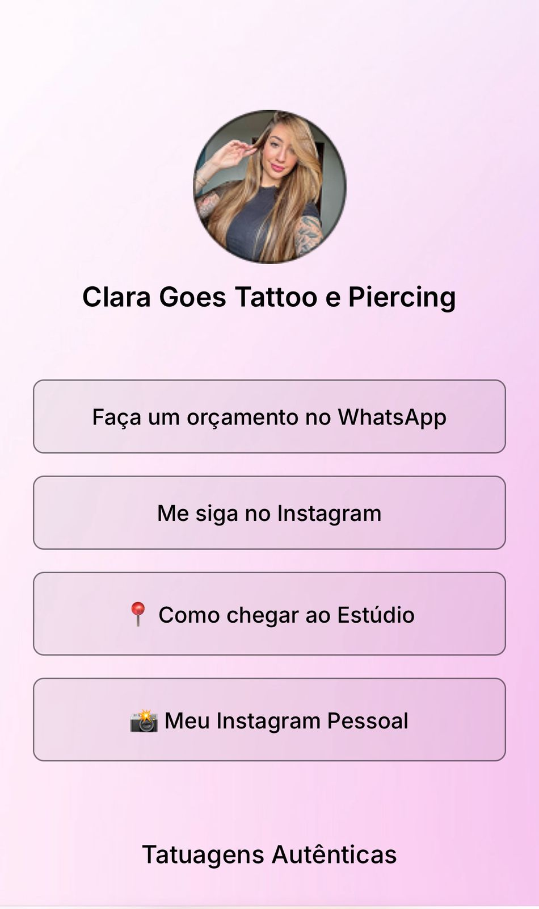

# Bionix Link na Bio 🔗

Projeto de página personalizada estilo **"Link na Bio"**, desenvolvido para criadores, tatuadores e empreendedores que desejam centralizar todos os seus links, destaques e contatos em um único lugar com design moderno e responsivo.


## 🚀 Acesse o site

👉 [bionix-link-bio](https://paulinho-coder.github.io/bionix-link-bio/)

---

## ✨ Funcionalidades

- Perfil com imagem e nome
- Links personalizados com ícones
- Seção de destaques com imagens (como tattoos e piercings)
- Botão de orçamento direto via WhatsApp
- Ícones de redes sociais
- Layout 100% responsivo
- Animações suaves e efeitos de clique

---

## 🧠 Tecnologias utilizadas

- HTML5
- CSS3
- JavaScript (básico para interação)
- Git & GitHub

---

Imagem site



---

## 🛠️ Como usar

1. Clone este repositório:
   ```bash
   git clone https://github.com/Paulinho-coder/bionix-link-bio.git


